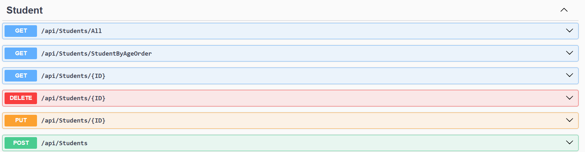
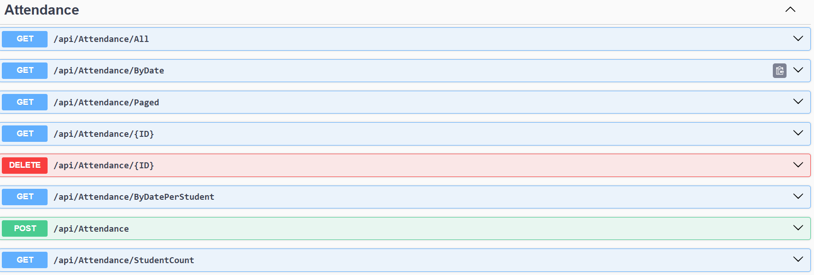
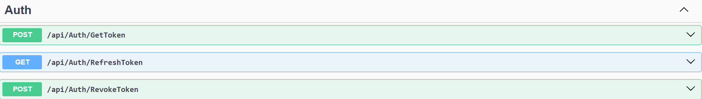
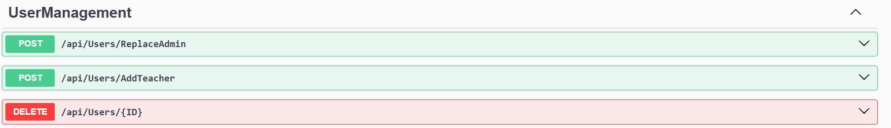
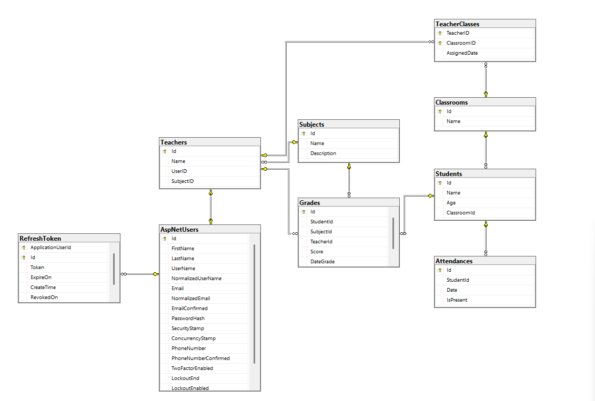

# 🎓 Student Management System - ASP.NET Core API (3-Tier Architecture)

A backend system built using **ASP.NET Core Web API** with a **3-Tier Architecture**, designed for managing students, teachers, grades, and attendance records. Follows SOULD principles & clean separation of concerns to promote scalability and maintainability.

---

## 🧱 Architecture

This project follows the **3-Tier Architecture** pattern:

Presentation Layer (API Controllers)
↓
Business Logic Layer (Services)
↓
Data Access Layer (Repositories + EF Core)

---

## 📁 Project Structure

StudentManagementSystem/
│
├── StudentManagement.API/ # Presentation Layer (Controllers, Program.cs)
│
├── StudentManagement.BLL/ # Business Logic Layer (Services, Interfaces)
│ └── DTOs/ # DTOs for transferring data
│
├── StudentManagement.DAL/ # Data Access Layer (Repositories, DbContext)
│ └── Entities/ # Domain Models
│
│
└── README.md

---

## 🛠️ Technologies Used

- **Backend:** ASP.NET Core Web API  
- **Architecture:** 3-Tier  
- **Database:** SQL Server  
- **ORM:** Entity Framework Core  
- **Authentication:**  JWT
-  **Authorization:**  Identity  
- **Dependency Injection:** Built-in .NET Core  

---

## 📌 Features

- ✅ Manage Students, Teachers, Subjects
- ✅ Roles Based on Admin and User
- ✅ Record and edit Grades
- ✅ Track Attendance
- ✅ Separate Business Logic from API
- ✅ Async operations for performance
- ✅ Swagger UI for API testing

---

## 📸 Controller Screenshots

---

### 👨‍🎓 StudentsController  
**Endpoint Prefix:** `/api/students`  

---

### 👩‍🏫 TeachersController  
**Endpoint Prefix:** `/api/teachers`  

---

### 📚 SubjectsController  
**Endpoint Prefix:** `/api/subjects`  

---

### 📝 GradesController  
**Endpoint Prefix:** `/api/grades`  

---

### 📅 AttendanceController  
**Endpoint Prefix:** `/api/attendance`  

---

### 🔐 AuthController  
**Endpoint Prefix:** `/api/auth`  

---

### 👥 UserManagementServiceController  
**Endpoint Prefix:** `/api/users`  

---

### 🗂️ Database Diagram  

---

## 📌 Future Enhancements
Role-based access control (Admin, Teacher, Student)

Export reports as PDF

Email notifications

Dashboard for statistics and insights

Mobile App (Flutter)

---

## 📄 License
MIT License — free to use, modify, and distribute.
